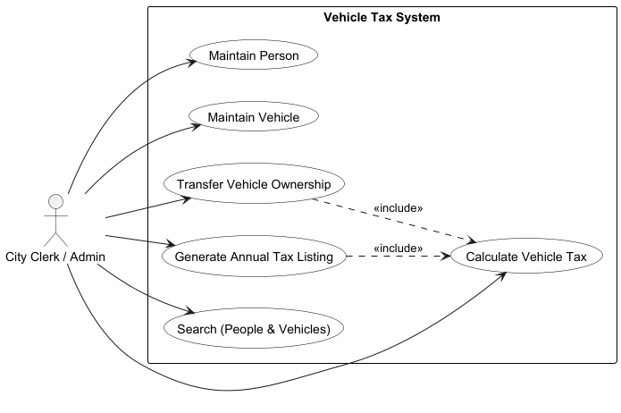
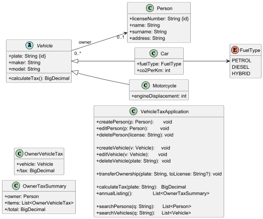
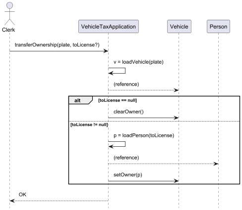
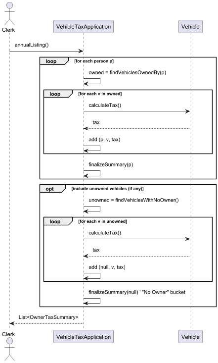

**Software Architecture. Object Oriented Design exercise:**

A city wants to implement a new system for managing all the taxes relative to vehicles: cars and motorcycles. Vehicles are identified by a plate number plus a maker and model. Also, people are identified in the system by license number, but we also want to store its name, surname and address.

The system must be able to add, edit and delete both vehicles and persons. When a vehicle is sold to a person, the system must be able to calculate the annual taxes for this vehicle. The tax depends on the vehicle type. Motorcycles are taxed by a 10% of its engine displacement. Petrol cars are taxed by a 1,4 € per gram of CO2 emissions, while diesel cars pay 1,8€ per gram of CO2. Finally, hybrid cars only pay 1,2 € per gram of CO2.

Once a year, the system must generate a list of all the vehicle owners, with the vehicles they have, the taxes for each vehicle and the total for each owner. It can happen that a person does not have any vehicle in a given moment and that a car is still in the car dealership so regarding tax point of view, it does not have an owner. Another case that can happen is that a vehicle owned by a person is sold or transferred to a different person.

Finally, the system also must be able to search for users and vehicles.

For this exercise we require the following results:

1. Use cases description and diagram.

* Actors

  * **City Clerk / Admin** (primary)
* Use case descriptions

  * **Maintain Person** — create / edit / delete a person.
  * **Maintain Vehicle** — create / edit / delete a vehicle.
  * **Transfer Vehicle Ownership** — record sale/transfer between persons (or to no owner).
  * **Calculate Vehicle Tax** — compute tax for a single vehicle.
  * **Generate Annual Tax Listing** — yearly report: owner → vehicles → per-vehicle taxes → per-owner total; includes owners with zero vehicles and vehicles with no owner.
  * **Search** — find people / vehicles.
* Use cases diagram

  

2. Class diagram
   Using the uscases and task description, we generate the following class diagram:

   
3. Sequence diagrams for the transfer vehicle and taxes listing use cases.

- Using the use cases can identified classes, we make the following sequence diagrams.

- For the transfer of a vehicle use case:

- And for the taxes listing use case:

8. Implementation in Java. You can use the java.util classes that you need.

- Now that we have made out class and sequence diagrams, you can find the fully implemented code in the src repository here:
   https://github.com/henryblu/SOFTENG/tree/main/VehicleTaxes/src
